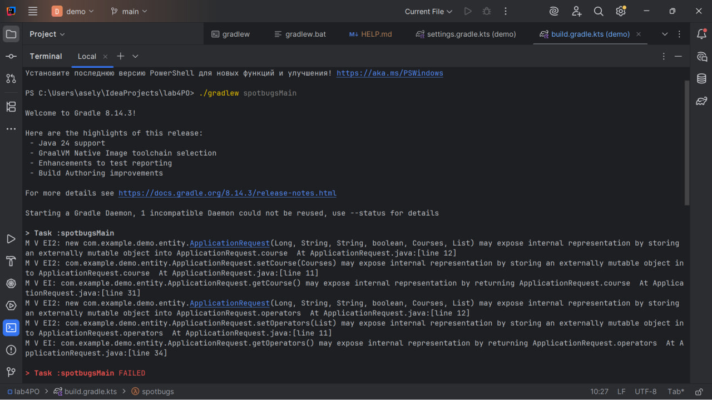
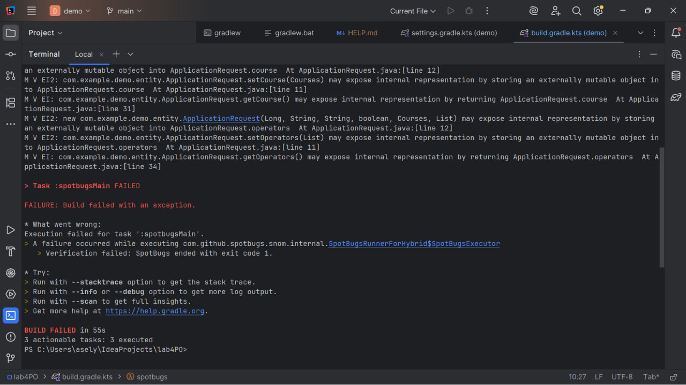
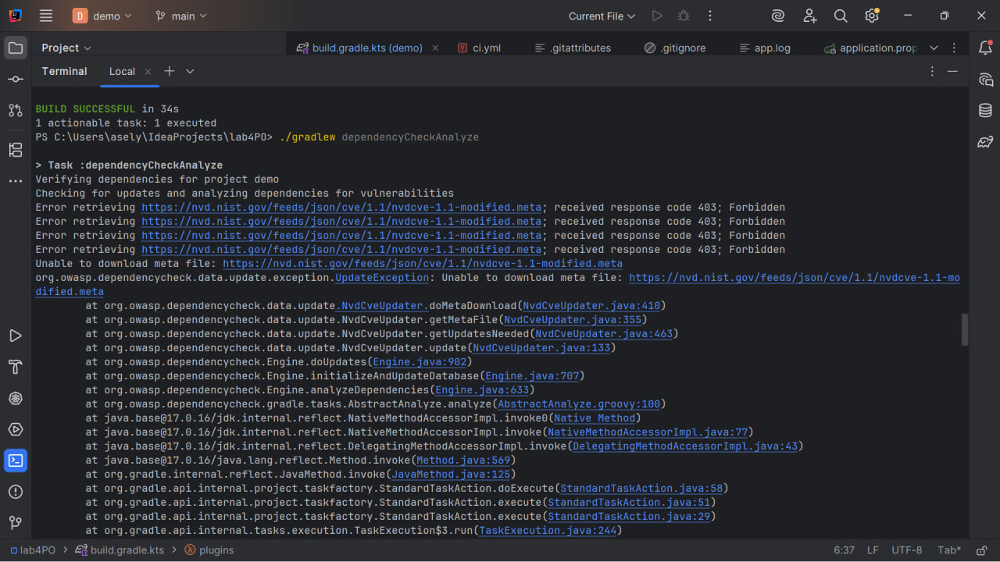
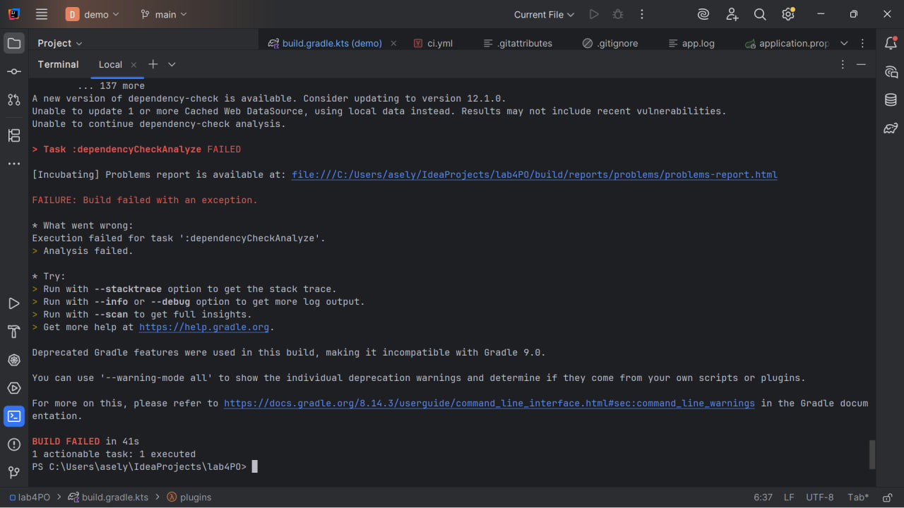

**CRM PROJECT**

**1. Pipeline Architecture Diagram**

Code → Build → Test → Security → Artifact → Deploy → Monitor

Code — writing the application
Build — building the project (Gradle)
Test — running tests
Security — checking vulnerabilities
Artifact — creating JAR file
Deploy — simulated deployment
Monitor — logging

**2. DevOps Lifecycle Explanation**

The application is a web system for managing course requests.
It supports creating, updating, and processing requests.

**3. CODE**

The application is built using Spring Boot with:

- 3 entities (ApplicationRequest, Courses, Operators)
- controller
- JPA repositories

**4. BUILD**

Build is done using Gradle:

    ./gradlew build

**5. TEST**

Automated tests are implemented for repositories:

- saving data
- checking custom queries

Uses in-memory H2 database.

**6. SECURITY (DevSecOps)**

Security tools used:

- SpotBugs — static code analysis
- OWASP Dependency-Check — dependency scanning

Pipeline fails if vulnerabilities are found.

**7. RELEASE (Artifact)**

A JAR file is created:

    build/libs/demo-0.0.1-SNAPSHOT.jar

It is uploaded as a pipeline artifact.

**8. DEPLOY**

Deployment is simulated:

    echo "Deploying to staging..."

**9. OPERATE**

Logging is implemented using Logback

Logs include:

- user actions
- errors
- system events

**10. MONITOR**

Monitoring is done using logs.

**11. Security Risks Identified**

Identified risks:

- User input (userName, phone) - unsafe data possible
- Exposure of internal object state - (detected by SpotBugs)

- Vulnerable dependencies
  (checked by OWASP Dependency-Check)

**12. How Artifacts Are Used**

Artifact (JAR file):

- created during build
- uploaded in pipeline
- used for deployment